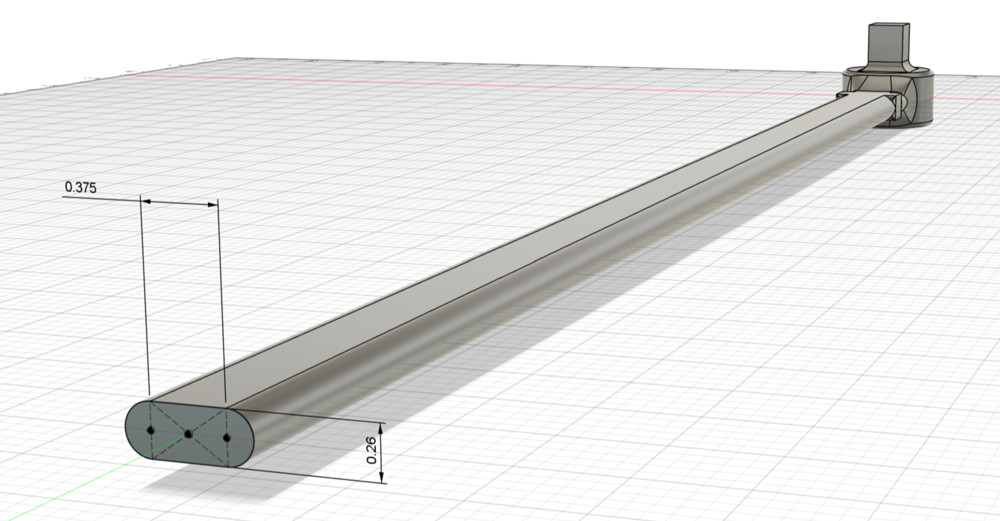
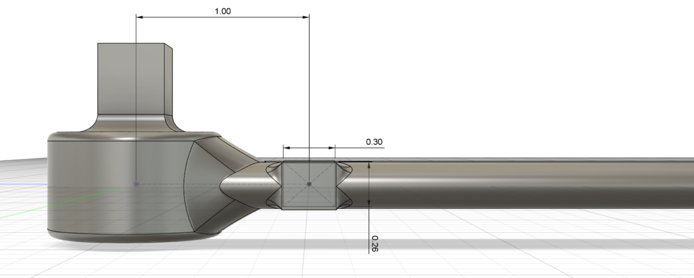
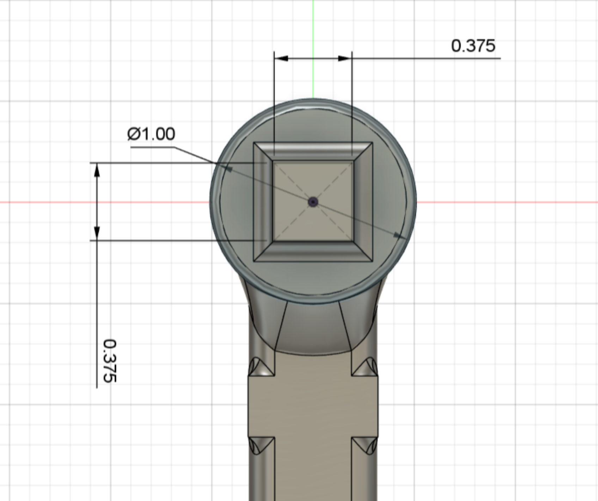
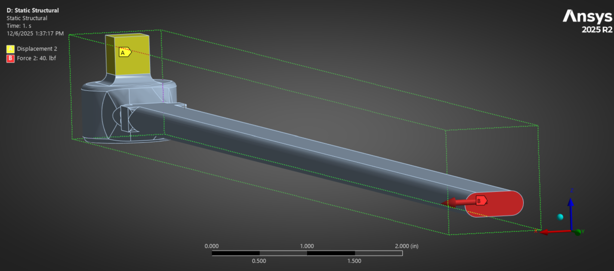
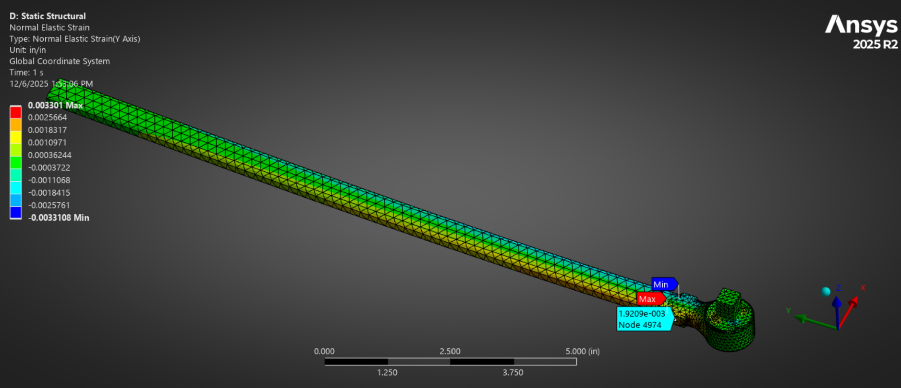
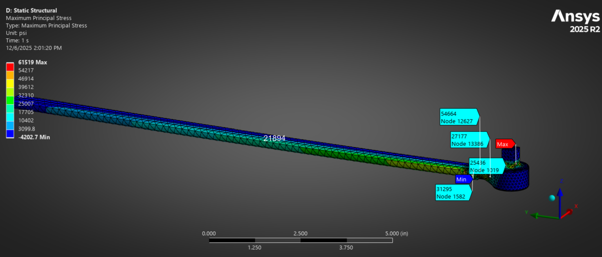
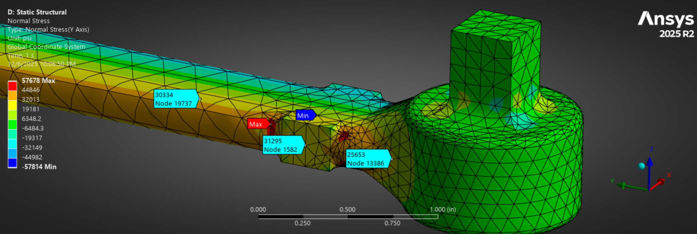
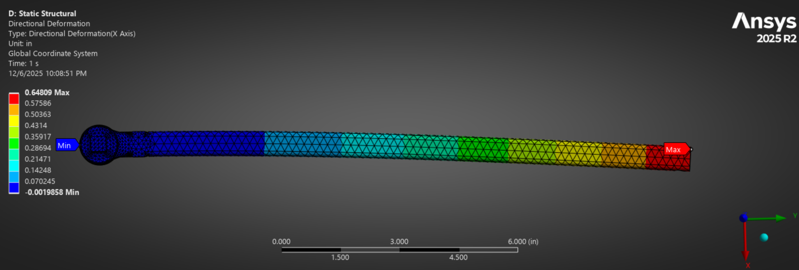
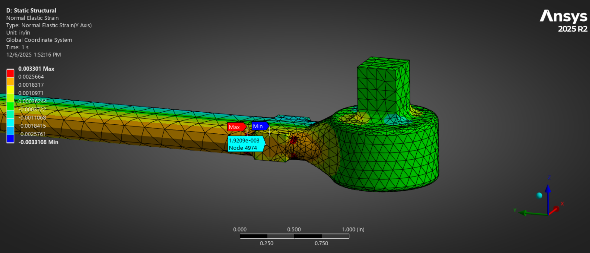

Assignment Partner: David Kaufman

For my materials final project, I was asked to design a torque wrench which meets the following specifications:

Factor of safety in yield: 4
Factor of safety for crack growth given an edge crack 0.04" long: 2
Factor of safety for fatigue: 1.5

Material must be a steel, aluminum, or titanium alloy

Must be rated for a torque of 600 in-lbf for 10^6 cycles

We must attain at least a 1.0 mV/V output at the rated torque

5.2.1.1 CAD & Dimensions
Our torque wrench design includes a slot-shaped cross section for ergonomics and to concentrate the material into the width, the most useful direction to increase the moment of inertia for stress from bending. Flat spots are incorporated on the handle near the drive to create a bonding surface to integrate the strain gauges. A circular head with a greater area moment of inertia was included to minimize stress on the fixed end due to the larger bending moment. There are fillets where the drive meets the circular head, and where the head meets the handle to prevent stress concentrations.  

  

  

  

Unspecified dimensions:
- Length: 16 inches. 

5.2.1.2 Material Selection

  

*Figure comparing fracture toughness and stiffness of steel, aluminum, and titanium alloys*

| Material                                                            | Young’s Modulus (psi) | Tensile Strength (psi) | Fracture Toughness (psi·√in) | Fatigue Strength @ 10^6 cycles (psi) |
|---------------------------------------------------------------------|------------------------|-------------------------|-------------------------------|---------------------------------------|
| M42 Steel                                                           | 32e6                   | 370e3                   | 15e3                          | 115e3                                 |
| Aluminum 7475                                                       | 10e6                   | 69e3                    | 30e3                          | 33e3                                  |
| Ti-6Al-4V (α–β titanium alloy)                                      | 16.1e6                 | 138e3                   | 74.6e3                        | 86e3                                  |
| Stainless steel, austenitic, ASTM CN-7M, cast, water-quenched       | 23.2e6                 | 62.4e3                  | 128e3                         | 37.5e3                                |

Given the constraints, we looked through several options for titanium, aluminum, and steel alloys in Granta to optimize for compliance while maintaining a good fracture toughness. (In hand caluclations with steel as a base case, the fracture toughness facture.)

After iterating through a few materials, we decided upon Titanium alpha-beta alloy (Ti-6Al-4V). This alloy’s relatively low Young’s Modulus allows for the required strain at the strain gauge, while its tensile strength, fracture toughness, and fatigue strength satisfy our factors of safety. 

5.2.1.3 Loads & Boundary Conditions

The 600 lb-in torque (Tag B - Red) was applied to the free end face using component scope in the x - direction. A zero displacement boundary condition (Tag A - Yellow) was applied to the four side faces and top face of the drive. 

  

5.2.1.4 Normal Strain Contours
Below are plots of the normal strain as scoped in the y - direction. We achieve a magnitude of normal strain of 1.9209E-3 at the gauge locations. Note that there are singularities in the strain contours near the corners of the strain gauge flats. These singularities can be considered a breakdown in the model as the normal strain magnitude decreases with distance from the corner of the flat along a constant thickness. So, this strain singularity can be ignored as it is simply a manifestation of a corner/fillet concentration.

  

5.2.1.5 Max Principal Stress Contours
In the max principal stress contours below, we see the design satisfies the factor of safety in yield and fatigue stress. For an upper limit set by the FOS in yield: 0.25 * 138 ksi = 34.5 ksi. For an upper limit set by the FOS in fatigue: 92 ksi. So, to satisfy our stress FOS’s we take 34.5 ksi as the max allowable stress.
Similar to the strain contours above, there are two regions of elevated stress that exceed this limit. From the close-up of the drive region, we see a stress concentration on a line separating the drive from the drive fillet. This singularity is a result of the zero displacement boundary condition, and can be ignored as stated by Prof. Zehnder and Dr. Bhaskaran. Four other concentrations are seen on the corners of the strain gauge flats on each side of the wrench. Since the stress decreases when analyzing an element adjacent to the corner in any direction, we can assume these singularities are a result of the corner/fillet, and are nonphysical so they can be ignored. 
Ignoring these singularities, the max principle stress we see in the model is approximately 32 ksi, less than our max allowable stress. A convergence mesh feature was used to iterate through mesh sizing on the principle and normal stress until the change in stress was less than 5% from one iteration to the next. Using this convergence mesh, we can reference these stresses with high confidence.

  

5.2.1.6 Max Normal Stress, X-Deflection
Normal stress contour:

  

Deflection in x-direction:

  

Strain at the strain gauges:

  

5.2.1.7

According to the strain at the strain gauge flat in the probe below, the torque wrench sensitivity is 1.9 mV/V. This satisfies the minimum sensitivity of 1mV/V. 

  

5.2.1.8

  

Vishay CEA-05-125UNA-350 Strain Gauge
[product spec sheet - https://docs.micro-measurements.com/?id=2541]

The strain gauge is essentially one resistive element with two terminals, so it is a quarter-bridge strain gauge. It has an overall length of just 0.275” x 0.125”, with the longer side meant to lie parallel to the axis of the handle. This fits comfortably on the flat sections of the sides torque wrench near the drive. (There is a flat spot on either side so that we can include two gauges for redundancy.) The strain gauge has a relatively high resistance compared to the other gauges in the family, 350 Ohms as opposed to 250 or 120, but this model has the lowest uncertainty at just 0.2%. 

It has a strain range of 5%, which is more than 25 times the strain we expect to see with the given force we’re applying. This allows for good definition and accuracy within the scope of the measurement but also a good factor of safety to avoid failure of the strain gauge. (Based on the material properties of the titanium and the factor of safety for tensile strength, the torque wrench would actually fail before the strain gauge.)

It is reasonably priced, with each gauge costing about $14 on Digikey - https://www.digikey.com/en/product-highlight/v/vishay-precision-group/cea-series-gages. 