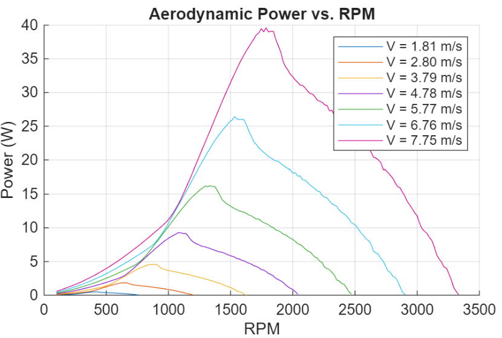
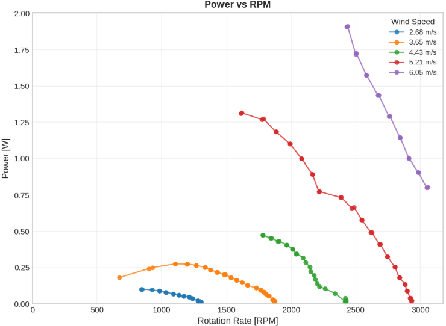
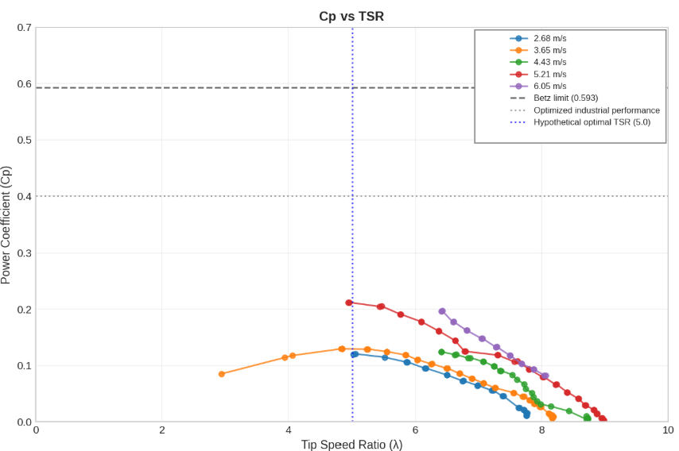

Project Overview: As part of MAE 4272, I was put on a team of three and asked to develop a wind turbine blade to extract the maximum energy from the flow in a wind tunnel. Our goal was to maximize efficiency, which we defined as the power extracted to the power available from the oncoming wind. The achievable threshold was limited theoretically by the Betz Limit, which defines a theoretical efficiency of about 60%, and then practically by the average industrial three blade turbine efficiency of ~45%.

$$
P = \omega \tau
$$

$$
C_p = \frac{P}{P_{\text{wind}}}
$$

$$
P_{\text{wind}} = \tfrac{1}{2}\,\rho A u^3
$$

We had structural constraints from the wind distribution limits, geometric constraints from the wind tunnel, and torque limits from the torque brake.

Assumptions:
| Aerodynamic | Structural | Numerical |
|-------------|------------|-----------|
| Steady flow | Torsion, axial stress, vibrations, and other dynamics neglected | Discretized span |
| Fixed induction factor ‘a’ (actual a → f(Ω, r)) | 3D printed material considered homogeneous & isotropic | Nearest-neighbor CL/CD lookup (no interpolation or extrapolation) |
| 2D section lift and drag (neglected radial flow) | Modelled as fixed at the root – actual mounting geometry ignored | Rootfinding function is convex |
| No wingtip effects or interference from walls | Moment of inertia taken as pitched rectangles |   |

Design Process: We began by selecting an airfoil based on the estimated Reynold's number and maximized the coefficient of lift to drag (while maintaining a reasonable profile for structure). Then, we set the pitch and twist of the blade so that at a tip speed ratio of 5, the angle of attack everywhere maximized the coeffient of lift to drag ratio. We chose to do this rather than setting the pitch purely to maximize torque because we wanted the blade to be optimal over a broader distribution of wind speeds and for that point to be easily calculated. Finally, we ensured that the blade could survive the maximum expected wind speed. The model efficiency was impossibly high, but the shape looked approximately correct and the efficiency was maximized around a tip speed ratio of five.

  

  

> 

> <strong>Hypothesis</strong> 
> Based on our model, peak efficiency will occur for our blade around a TSR of 5.  
> The efficiency of the model and theoretical power generated are unreasonable  
> owing to various simplifying assumptions, but based on the efficiency of  
> typical blades of this size and rotation rate, we anticipate a maximum  
> efficiency of about 45%.
> 

  

Testing Summary: We calibrated sensors and organized our sampling so that we could develop power curves for several windspeeds. At higher desired wind speeds, we had to iteratively increase the torque and windspeed so that we didn't exceed the maximum rpm or voltage set by the torque brake.

Results: 
> 

> <strong>Results</strong> 
> The shape of the power curves is very similar to what we expected and the peak of each power curves 
> occurs exactly at a tip speed ratio of five. The efficiency rose as we increased the oncoming wind, 
> which was surprising considering that the assumptions for steadiness probably became less valid 
> at higher wind speeds. This may be attributed to intrinsic torques which became a smaller f
> raction of the overall torque as the rotation rate and torque brake torque increase. 
> 

There is also an interesting kink visible in the power curves at 2300rpm which corresponded to a significant increase in noise from the blades. We're confident this corresponds to a vibrational mode of the blades.

  

  

My Contributions & Reflections: I was resonsible for developing the model which guided the design of our blade. Some parameters were directly taken from the results of the model such as the pitch of the blade, and then the taper and root chord length being picked from a heat map of potential options. I also modelled the structural failure and maximum expected rpm and am happy to report that neither was exceeded. Looking back on this project is interesting because blade design is iterative, but we only had one shot to experiment with our blade. Given more time, we would go back and refine the model with our results, ensuring that the rpm values are correct for different torques. This might demand questioning the assumptions such as the constant induction factor. It would also be helpful to model the hub for structural failure, including it in a simulation tool such as ANSYS for fluid flow and stress. In terms of the testing, it might be helpful to use a stronger torque brake so that we can extract more power from higher wind speeds. 
